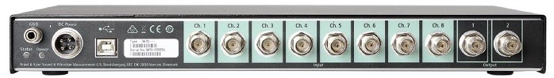

## BZ-7852 Electroacoustic Engine Examples 

This repository includes example code for using Python and matlab together with Brüel & Kjær 3670-A-082-R  (8 input/2 output) DAQ system

The BZ-7852 Electroacoustic Engine can be downloaded from [Downloads](https://www.bksv.com/en/services/downloads/3670-usb-audio-demo-tool/bz-7852-electro-acoustic-engine).

